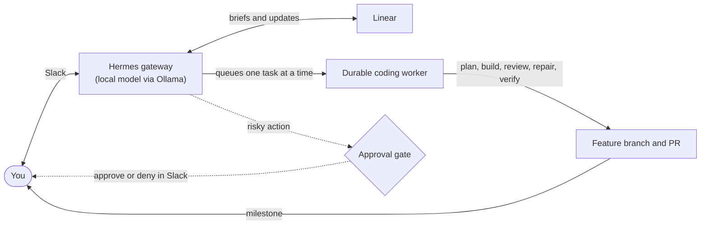

# ☕ Ristretto AI

[](https://github.com/SilviaAre95/ristretto-ai/actions/workflows/ci.yml)
[](LICENSE)
[](#-development)
[](docs/project-status.md)
[](docs/development.md)

**Ristretto ("Ris") is a configurable, always-on personal operations
assistant** built on the open-source Hermes Agent runtime. Ris talks in Slack,
tracks configured work in Linear, runs supervised coding tasks in durable
workers, and requests approval before risky actions.

> Pre-release `0.1.0`. See [`docs/project-status.md`](docs/project-status.md)
> and [`docs/open-source-readiness.md`](docs/open-source-readiness.md).

## ✨ Highlights

- 🏠 **Local-first** orchestrator through Ollama.
- 💬 **Slack Socket Mode** with an explicit user allowlist.
- 📋 **Linear-backed morning brief** with unchanged-board suppression.
- 🔁 **Crash-safe, one-at-a-time coding workers** using feature branches and
  pull requests.
- 🧩 **Named/custom model flows** with enforced read-only planning and review.
- 🔒 **No auto-merge** — production, destructive, costly, and secret-bearing
  actions remain approval-gated.

## 🗺️ How it works



## 📁 Repository map

| Path | Purpose |
|---|---|
| `ristretto.yaml` | Public instance, provider, repository, and flow schema. |
| `ristretto/` | Configuration, CLI, doctor, and multi-stage flow runner. |
| `hermes/` | Public Hermes baseline, skills, scripts, tests, and cron example. |
| `slack/` | Generic Slack application manifest. |
| `docs/features/` | Behavior contracts and explicit non-goals. |
| `docs/development.md` | Contributor environment and verification. |
| `docs/releases.md` | Versioning and release procedure. |
| `docs/ui-gadget.md` | Proposed macOS menu-bar companion. |

Personal runtime state, issue exports, channel IDs, repository mappings,
credentials, logs, and knowledge-vault content are deliberately excluded.

## 🛠️ Development

```bash
make setup
source .venv/bin/activate
make check
make public-check
```

## 📦 Install the CLI

```bash
make install
ristretto validate
ristretto flow list
ristretto flow show balanced
ristretto doctor
```

The installer creates `~/.config/ristretto/config.yaml` (or the equivalent
under `$XDG_CONFIG_HOME`) and a managed CLI symlink. It does not touch Hermes,
credentials, or services. `scripts/uninstall.sh` removes the CLI link and
preserves configuration unless `--purge-config` is explicitly supplied.

## ⚙️ Configure an instance

```bash
ristretto configure \
  --linear-team PROJ \
  --slack-home-channel YOUR_HOME_CHANNEL_ID \
  --slack-prs-channel YOUR_PRS_CHANNEL_ID \
  --slack-alerts-channel YOUR_ALERTS_CHANNEL_ID \
  --knowledge-vault "$HOME/Notes" \
  --repository "Example App=$HOME/code/example-app"
```

These values are non-secret and live only in the user configuration. Provider
tokens and `SLACK_ALLOWED_USERS` belong in `~/.hermes/.env`, never here.
Custom cloud providers must reference tokens through `auth_token_env`; literal
credentials in `ristretto.yaml` are rejected.

## 🪽 Install Hermes assets

After installing and authenticating Hermes Agent:

```bash
make install-hermes
```

This preserves existing Hermes config, persona, credentials, jobs, and
unrelated skills. It adds Ristretto's skills/scripts, creates the isolated
worker profile when missing, and creates the morning brief only when no job
with that name exists. The gateway service remains unchanged. To explicitly
install and start the service:

```bash
bash scripts/install-hermes.sh --service
```

## 🔀 Coding flows

| Flow | Pipeline |
|---|---|
| `classic` (default) | Existing Claude `/harness:loop-dev`, with local fallback only when Claude is unavailable. |
| `balanced` | Claude plan → local build → Codex review → local repair → verify → Claude PR. |
| `quality` | Claude plan/build/repair → Codex review → verify → Claude PR. |
| `local` | Local plan/build/review/repair → verify → local PR. |

Add custom flows using the validated schema in
[`docs/features/custom-model-flows.md`](docs/features/custom-model-flows.md).

## 🔐 Safety and publication

`make check` runs deterministic tests, parsers, syntax checks, diff hygiene,
and credential-pattern scans. `make public-check` additionally rejects live
runtime files, machine paths, and Slack channel IDs. Do not publish a release
unless both commands pass.

The approval gate has been verified for explicit approve and deny decisions,
but timeout/park-on-no-response behavior is not yet independently verified.
Until it is, do not rely on timeout alone as a safety boundary for unattended
risky work.

Development history predating this public release lives in a private
repository that must never receive a public remote. `make setup` installs a
local pre-push guard that blocks that history if it is ever present. This
public repository is a fresh snapshot created by `scripts/export-public.sh`;
see [`docs/open-source-readiness.md`](docs/open-source-readiness.md).

## 👋 Author

Built by **Silvia Arellano**. I write about data engineering and AI agents on
Medium.

[](https://silviadata.dev)
[](https://medium.com/@silvia.datadev)
[](https://linkedin.com/in/silvia-arellano-de)
[](https://github.com/SilviaAre95)
[](https://huggingface.co/silvia-datadev)
[](https://silviadatadev.gumroad.com)

## 📄 License

MIT — see [`LICENSE`](LICENSE).
